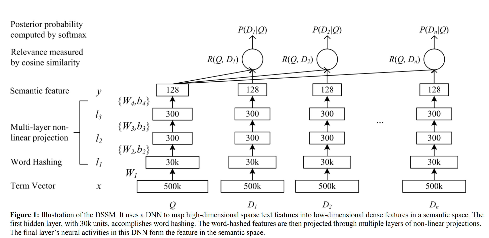

# 说明

这是一份关于推荐系统中DSSM模型的代码实现，本项目采用的是pytorch框架。

## DSSM介绍



算法思路：对于查询Q来说，通过DNN得到对应的语义特征，而对于所需要查询的$D_i$也通过另一个DNN来得到语义特征，此为双塔。最后通过相似函数（一般是内积或者其他函数）计算两边的相似度得到最后的预测概率结果，在本项目中，采用的是内积+sigmoid来得到相似结果。

# 简单使用

```python
python main.py
```

# 实验

## 数据集介绍

* ML-100k

通过对每一个用户的交互序列进行时间戳排序，然后针对每一个交互记录构造对应的历史交互序列，测试集为最后一个交互记录，训练集为前面所有的记录。同时采用随机负采样构建数据集。

## 模型表现

| 数据集 |  Loss  | Precision |  AUC  |
| :-----: | :----: | :-------: | :----: |
| ML-100k | 0.0183 |  0.7630  | 0.8935 |

# TODO-List

* 将场景转为推荐中的召回场景
* 使用多种数据集进行展示
